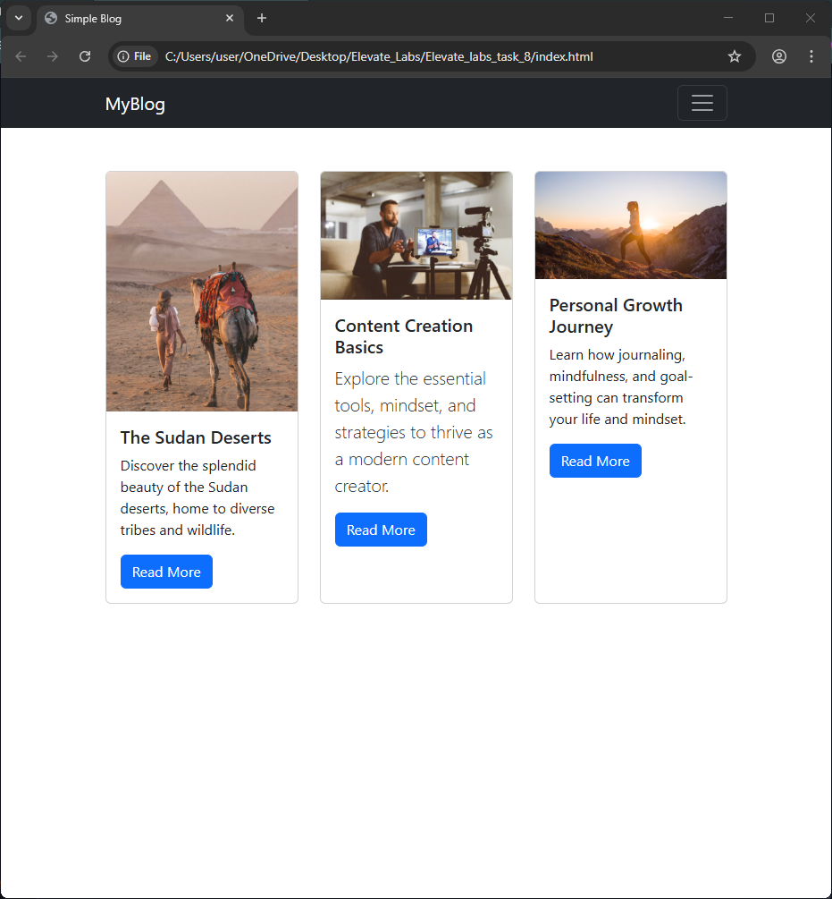

# Elevate_labs_week_8
Creating a Simple Blog Layout Using Bootstrap 5

# Simple Blog Layout Using Bootstrap 5

## Overview
This project is a responsive blog layout built using Bootstrap 5. It includes a navbar, blog post cards, and a footer with social icons.

## Features
- Responsive navbar with brand and links
- Blog cards with image, title, description, and button
- Bootstrap grid system for layout
- Footer with social media icons
- Custom styles using Bootstrap utility classes

## Tools Used
- Bootstrap 5 CDN
- VS Code
- HTML & CSS

## How to Run
1. Clone the repo
2. Open `index.html` in your browser
3. Resize the browser to test responsiveness

## Screenshots

## What I Learned
- How to use Bootstrap grid and components
- How to customize styles with utility classes
- How to build responsive layouts quickly

## Interview Questions Covered
- What is Bootstrap?
- How to include Bootstrap in a project?
- What is the grid system?
- What are utility classes?
- How do you customize Bootstrap?
- Difference between container and container-fluid?
- What are Bootstrap cards?
- How to make responsive navigation?
- What is a CDN?
- How to override Bootstrap styles?
